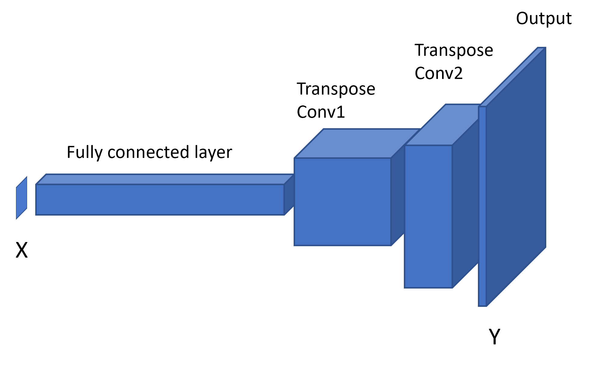

===================
Emulating with ESEm
===================

ESEm provides a simple and streamlined interface to emulate earth system datasets stored as iris Cubes, denoted :math:`Y` in the following documentation.
The corresponding predictors (:math:`X`) can be provided as a numpy array or pandas `DataFrame`.
This emulation is essentially just a regression estimating the functional form:

.. math::

   Y \approx f(X)

and can be performed using a variety of techniques using the same API.

Gaussian processes emulation
============================

Gaussian processes (GPs) are a popular choice for model emulation due to their simple formulation and robust uncertainty estimates, particularly in cases of relatively small amounts of training data.
Many excellent texts are available to describe their implementation and use (Rasmussen and Williams, 2005) and we only provide a short description here.
Briefly, a GP is a stochastic process (a distribution of continuous functions) and can be thought of as an infinite dimensional normal distribution (hence the name).

The ESEm GP emulation module provides a thin wrapper around the `GPFlow <https://gpflow.readthedocs.io/en/master/#>`_ implementation.
Please see their documentation for a detailed description of the implementation.

An important consideration when using RP regression is the form of the covariance matrix, or kernel. Typical kernels include: constant; linear; radial basis function (RBF; or squared exponential); and Matérn 3/2 and 5/2 which are only once and twice differentiable respectively.
Kernels can also be designed to represent any aspect of the functions of interest such as non-stationarity or periodicity.
This choice can often be informed by the physical setting and provides greater control and interpretability of the resulting model compared to e.g., Neural Networks.

.. Note::
    By default, ESEm uses a combination of linear, RBF and polynomial kernels which are suitable for the smooth and continuous parameter response expected for the examples used in this paper and related problems.
    However, given the importance of the kernel for determining the form of the functions generated by the GP we have also included the ability for users to specify combinations of other common kernels.
    See e.g., `Duvenaud, 2011 <https://www.cs.toronto.edu/~duvenaud/thesis.pdf>`_ for a clear description of some common kernels and their combinations, as well as work towards automated methods for choosing them.

The framework provided by GPFlow also allows for multi-output GP regression and ESEm takes advantage of this to automatically provide regression over each of the output features provided in the training data.
E.g. :math:`Y` can be of arbitrary dimensionality. It will be automatically flattened and reshaped before being passed to GPFlow.

The most convenient way to setup a GPFlow emulator is using the :func:`esem.gp_model` function which can be imported directly:

.. code-block:: python

    from esem import gp_model

This creates a regression model with a default kernel as described above but provides a convenient interface for defining arbitrary kernels as described in the function description :func:`esem.gp_model`.

Examples of emulation using Gaussian processes can be found in `Emulating_using_GPs.ipynb <examples/Emulating_using_GPs.html>`_ and `CMIP6_emulator.ipynb <examples/CMIP6_emulator.html>`_.

Neural network emulation
========================

While fully connected neural networks have been used for many years, even in climate science, the recent surge in popularity has been powered by the increases in expressibility provided by deep, convolutional neural networks (CNNs) and the regularisation techniques which prevent these huge models from over-fitting the large amounts of training data required to train them.
Many excellent introductions can be found elsewhere but, briefly, a neural network consists of a network of nodes connecting (through a variety of architectures) the inputs to the target outputs via a series of weighted activation functions.
The network architecture and activation functions are typically chosen a-priori and then the model weights are determined through a combination of back-propagation and (batch) gradient descent until the outputs match (defined by a given loss function) the provided training data. As previously discussed, the random dropping of nodes (by setting the weights to zero), termed dropout, can provide estimates of the prediction uncertainty of such networks.
The computational efficiency of such networks and the rich variety of architectures available have made them the tool of choice in many machine learning settings, and they are starting to be used in climate sciences for emulation, although the large amounts of training data required (especially compared to GPs) have so far limited their use somewhat.

ESEm provides a baseline CNN architecture based on the `Keras <https://keras.io/>`_ library which essentially acts as a decoder - transforming input parameters into predicted 2(or 3) dimensional output fields:

This model can be easily constructed using the :func:`esem.cnn_model` function.
It is possible to use any Keras model in this way though and there are many potential ways of improving / developing this simple model.

An example of emulation using this convolution neural network can be found in `Emulating_using_ConvNets.ipynb <examples/Emulating_using_ConvNets.html>`_.

Random forest emulation
=======================

ESEm also provides the option for emulation with Random Forests using the open-source implementation provided by scikit-learn.
Random Forest estimators are comprised of an ensemble of decision trees; each decision tree is a recursive binary partition over the training data and the predictions are an average over the predictions of the decision trees.
As a result of this architecture, Random Forests (along with other algorithms built on decision trees) have two main attractions.
Firstly, they require very little pre-processing of the inputs as the binary partitions are invariant to monotonic rescaling of the training data.
Secondly, and of particular importance for climate problems, they are unable to extrapolate outside of their training data because the predictions are averages over subsets of the training dataset.

This model can be constructed using the :func:`esem.rf_model` function. All of the relevant scikit-learn arguments and keyword-arguments can be provided through this interface.

An example of emulation using the random forest can be found in `CRM_Emulation_with_RandomForest.ipynb <examples/CRM_Emulation_with_RandomForest.html>`_.

Data processing
===============

Many of the above approaches make assumptions, or simply perform better, when the training data is structured or distributed in a certain way.
These transformations are purely to help the emulator fit the training data, and can complicate comparison with e.g. observations during calibration.
ESEm provides a simple and transparent way of transforming the datasets for training, and this automatically un-transforms the model predictions to aid in observational comparison.

Where these transformations are strictly necessary for a given model then it will be included in the wrapper function. Other choices are left to the user to apply as required.

A full list of the data processors can be found in the `API documentation <api.html#dataprocessor>`_.

Feature selection
=================

ESEm includes a simple utility function that wraps the scikit-learn LassoLarsIC regression tool in order to enable an
initial feature (parameter) selection. This can be useful to reduce the dimensionality of the input space. Either the
Akaike information criterion (AIC) or the Bayes Information criterion (BIC) can be used, although BIC is the default.

For example,

.. code-block:: python

    from esem import gp_model
    from esem.utils import get_param_mask

    # X and Y are our model parameters and outputs respectively.
    active_params = get_param_mask(X, y)

    # The model parameters can then be subsampled either directly
    X_sub = X[:, active_params]

    # Or by specifying the GP active_dims
    active_dims, = np.where(active_params)
    model = gp_model(X, y, active_dims=active_dims)

Note, this estimate only applies to one-dimensional outputs. Feature selection for higher dimension outputs is a much
harder task beyond the scope of this package.
